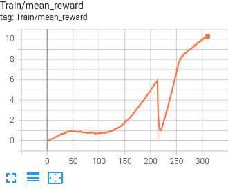
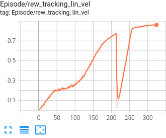
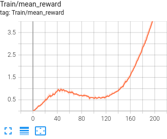
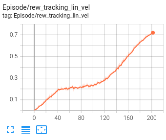

# ElSpider Air Robot Tasks

## Environment Setup

```bash
conda activate diffuseloco
```

## BasePoseAdapt ElSpiderAir

Train ElSpider Air with base pose adaptation for collision avoidance.

**Training Commands:**

```bash
python legged_gym/scripts/train.py --task=el_mini_base_pose_adapt --num_envs=4096 --resume --headless
python legged_gym/scripts/play.py --task=el_mini_base_pose_adapt --num_envs=48 --checkpoint=-1
```

**Test Base Pose Control:**

```bash
python legged_gym/scripts/train.py --task=el_mini_base_pose_ctrl --num_envs=48
```

## ElSpiderAir Flat Terrain

**Training Epoch:** ~300

**Training Profile:**

- 70 epoch: velocity tracking reward grows up
- 160 epoch: enter reward stage 1
- 300 epoch: walking good

**Training Epoch:** ~500 (Actuator Net Disabled)

**Training Profile:**

- 100 epoch: velocity tracking reward grows up
- 250 epoch: enter reward stage 1
- 500 epoch: walking good

```bash
python legged_gym/scripts/train.py --task=elspider_air_flat --num_envs=6144 --resume --headless
python legged_gym/scripts/play.py --task=elspider_air_flat --num_envs=48 --checkpoint=-1  --load_run=Mar13_19-58-56_ --resume
```

## ElSpiderAir Batch Rollout

**Test Commands:**

```bash
python legged_gym/tests/test_batch_rollout_env.py --task=elspider_air_batch_rollout --num_envs=10

python legged_gym/tests/test_play_batch_rollout_env.py --task=elspider_air_batch_rollout --num_envs=10 --checkpoint=-1

python legged_gym/tests/test_play_batch_rollout_env.py --task=elspider_air_batch_rollout_flat --num_envs=10 --checkpoint=-1
```

Train ElSpider Air with batch rollout capability for trajectory optimization.

**Training Epoch:** ~500

**Training Profile (Actuator Net Disabled):**

- **Plane, 6144 Envs**
    - 150 epoch: velocity tracking reward grows up
    - 250 epoch: enter reward stage 1
    - 500 epoch: walking good

    
    

- **Confined, 4096 Envs**
    - ? epoch: velocity tracking reward grows up
    - ? epoch: enter reward stage 1
    - ? epoch: walking good

```bash
python legged_gym/scripts/train.py --task=elspider_air_batch_rollout --num_envs=4096 --resume --headless
python legged_gym/scripts/play.py --task=elspider_air_batch_rollout --num_envs=32 --checkpoint=-1
```

## ElSpiderAir Batch Rollout Flat

Train ElSpider Air with batch rollout capability on flat terrain (without perception features).

**Training Profile:**
6144 envs




```bash
python legged_gym/scripts/train.py --task=elspider_air_batch_rollout_flat --num_envs=6144 --resume --headless
python legged_gym/scripts/play.py --task=elspider_air_batch_rollout_flat --num_envs=32 --checkpoint=-1
```

## ElSpiderAir Trajectory Gradient Sampling

Train ElSpider Air with gradient sampling for trajectory optimization.

**Test Commands:**

```bash
python legged_gym/tests/test_play_batch_rollout_env.py --task=elspider_air_traj_grad_sampling --num_envs=10 --checkpoint=-1
```

**Rollout:**

```bash
python legged_gym/scripts/train.py --task=elspider_air_traj_grad_sampling --num_envs=6144 --resume --headless
python legged_gym/scripts/play.py --task=elspider_air_traj_grad_sampling --num_envs=32 --checkpoint=-1
```

## Pose ElSpiderAir Flat

Train ElSpider Air for pose control on flat terrain.

```bash
python legged_gym/scripts/train.py --task=pose_elspider_air_flat --num_envs=6144 --resume --headless
python legged_gym/scripts/play.py --task=pose_elspider_air_flat --num_envs=48 --checkpoint=-1
```

## FootTrack ElSpiderAir

**Hang Up Mode:**

```bash
python legged_gym/scripts/train.py --task=foot_track_elspider_air_hang --num_envs=6144 --resume --headless
python legged_gym/scripts/play.py --task=foot_track_elspider_air_hang --num_envs=48 --checkpoint=-1
```

**On Ground Mode:**

```bash
python legged_gym/scripts/train.py --task=foot_track_elspider_air_flat --num_envs=6144 --resume --headless
python legged_gym/scripts/play.py --task=foot_track_elspider_air_flat --num_envs=48 --checkpoint=-1
```

## ElSpiderAir Rough Terrain

**Training Tip:**
IMPORTANT

1. Pretrain model on flat terrain to learn correct gait.
2. Use the pretrained model to train on rough terrain.

**Training Epoch:** ~500

**Training Profile:**

- 100 epoch: velocity tracking reward starts to grow up
- 100-500 epoch: terrain level grows up, rew_ang_vel~0.19, rew_lin_vel~0.57

```bash
python legged_gym/scripts/train.py --task=elspider_air_rough --num_envs=4096 --resume --headless
python legged_gym/scripts/play.py --task=elspider_air_rough --num_envs=48 --checkpoint=-1
```

## ElSpiderAir Rough RayCast

```bash
python legged_gym/scripts/train.py --task=elspider_air_rough_raycast --num_envs=6144 --resume --headless
python legged_gym/scripts/play.py --task=elspider_air_rough_raycast --num_envs=8 --checkpoint=-1
```
